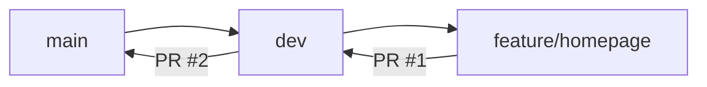

<div align="center">


# **Evolusi App**

<p align="center">
  <strong>Aplikasi Web Modern untuk Tugas Akhir Pemrograman Web</strong>
</p>

<p align="center">
  <a href="https://github.com/laravel/framework/actions"></a>
  <a href="https://packagist.org/packages/laravel/framework"></a>
  <a href="https://packagist.org/packages/laravel/framework"></a>
  
  
  
</p>

<p align="center">
  <a href="#-tentang-proyek">Tentang</a> •
  <a href="#-fitur-utama">Fitur</a> •
  <a href="#-tech-stack">Tech Stack</a> •
  <a href="#-instalasi">Instalasi</a> •
  <a href="#-struktur-proyek">Struktur</a> •
  <a href="#-workflow-git">Workflow</a> •
  <a href="#-license">License</a>
</p>

</div>

---

## 📖 Tentang Proyek

**Evolusi App** adalah aplikasi web yang dibangun menggunakan **Laravel 11** sebagai pemenuhan tugas akhir mata kuliah **Pemrograman Web (PKW)**. Aplikasi ini dirancang dengan arsitektur modern, desain *responsive*, dan mengikuti *best practices* pengembangan web kontemporer.

<div align="center">

| Detail | Informasi |
|--------|-----------|
| **Mata Kuliah** | Pemrograman Web |
| **Tugas** | Repository Pertama (UAS) |
| **Framework** | Laravel 11 |
| **Status** | 🟢 Aktif Development |

</div>

---

## ✨ Fitur Utama

| Fitur | Deskripsi |
|-------|-----------|
| 🔐 **Authentication System** | Login, Register, Email Verification, Password Reset dengan Laravel Breeze |
| 📱 **Responsive Design** | Mobile-first approach, optimal di semua ukuran layar |
| 🎨 **Modern UI/UX** | Custom design dengan TailwindCSS, dark mode support |
| 🗄️ **Database & Migrations** | Eloquent ORM, migrasi terstruktur, seeder & factory |
| ⚡ **Performance** | Route caching, config caching, optimized asset loading |
| 🔒 **Security** | CSRF protection, XSS prevention, SQL injection protection |
| 🧪 **Testing** | Feature & Unit tests dengan PHPUnit |
| 🚀 **CI/CD Ready** | GitHub Actions workflow untuk testing otomatis |

---

## 🛠 Tech Stack

<div align="center">

### Backend


### Frontend


### Database & Tools


</div>

---

## 📸 Preview

<div align="center">

### Homepage
> *Desain custom dengan hero section, feature cards, dan navigasi modern*


### Fitur Section
> *Kartu fitur dengan animasi scroll dan hover effects*


</div>

> **Note**: Screenshot di atas adalah placeholder. Ganti dengan screenshot aktual aplikasi Anda.

---

## 🚀 Instalasi

### Prasyarat
- PHP ≥ 8.2
- Composer
- Node.js ≥ 18 & NPM
- MySQL / MariaDB

### Langkah Instalasi

```bash
# 1. Clone repository
git clone https://github.com/USERNAME/evolusi-pl-NIM.git
cd evolusi-pl-NIM

# 2. Install dependencies PHP
composer install

# 3. Install dependencies Node.js
npm install

# 4. Copy environment file
cp .env.example .env

# 5. Generate application key
php artisan key:generate

# 6. Konfigurasi database di .env
# DB_DATABASE=evolusi_app
# DB_USERNAME=root
# DB_PASSWORD=

# 6. Jalankan migrasi & seeder
php artisan migrate --seed

# 7. Build assets
npm run build
# atau untuk development: npm run dev

# 8. Jalankan server
php artisan serve
```

Aplikasi akan berjalan di `http://localhost:8000`

---

## 📁 Struktur Proyek

```
evolusi-pl-NIM/
├── .github/
│   └── workflows/
│       └── ci.yml              # GitHub Actions CI/CD
├── app/
│   ├── Http/
│   │   ├── Controllers/        # Controller aplikasi
│   │   └── Middleware/         # Custom middleware
│   ├── Models/                 # Eloquent Models
│   └── Providers/              # Service Providers
├── bootstrap/
├── config/                     # File konfigurasi
├── database/
│   ├── factories/              # Model factories
│   ├── migrations/             # Database migrations
│   └── seeders/                # Database seeders
├── public/                     # Public assets
├── resources/
│   ├── css/                    # Stylesheets
│   ├── js/                     # JavaScript
│   └── views/                  # Blade templates
│       ├── components/         # Reusable components
│       ├── layouts/            # Layout templates
│       └── welcome.blade.php   # Custom homepage
├── routes/
│   ├── web.php                 # Web routes
│   └── api.php                 # API routes
├── storage/
├── tests/
│   ├── Feature/                # Feature tests
│   └── Unit/                   # Unit tests
├── vendor/
├── .env.example
├── .gitignore
├── artisan
├── composer.json
├── package.json
├── phpunit.xml
├── tailwind.config.js
├── vite.config.js
└── README.md
```

---

## 🌿 Workflow Git

Proyek ini mengikuti alur **Git Flow** sederhana dengan **Branch Protection**:



### Branch Strategy

| Branch | Tujuan | Protection |
|--------|--------|------------|
| `main` | Production-ready code | ✅ Required PR, Status Checks |
| `dev` | Integration branch | ✅ Required PR, Status Checks |
| `feature/*` | Feature development | ❌ No direct push to main/dev |

### Pull Request Flow

1. **PR #1**: `feature/homepage` → `dev`
   - Review kode, jalankan test
   - Merge setelah approved & CI hijau

2. **PR #2**: `dev` → `main`
   - Final review sebelum release
   - Tag version setelah merge

### Conventional Commits

Semua commit mengikuti format:
```
<type>(<scope>): <description>

Types: feat, fix, docs, style, refactor, test, chore
```

Contoh:
```bash
feat: add custom homepage design
fix: resolve mobile navigation issue
docs: update README with installation guide
test: add feature tests for authentication
chore: update dependencies
```

---

## ⚙️ GitHub Actions Workflow

File workflow: `.github/workflows/ci.yml`

```yaml
name: Laravel CI

on:
  push:
    branches: [main, dev]
  pull_request:
    branches: [main, dev]

jobs:
  test:
    runs-on: ubuntu-latest
    steps:
      - uses: actions/checkout@v4
      - name: Setup PHP
        uses: shivammathur/setup-php@v2
        with:
          php-version: '8.2'
      - name: Install Dependencies
        run: composer install --no-interaction --prefer-dist
      - name: Generate Key
        run: php artisan key:generate --force
      - name: Run Tests
        run: php artisan test --no-coverage
```

**Status**: 

---

## 📋 Checklist Tugas

- [x] Repository bernama `evolusi-pl-NIM` (public)
- [x] Aplikasi Laravel 11
- [x] Minimal 5 commit (Conventional Commits)
- [x] Branch: `main`, `dev`, `feature/homepage`
- [x] Perubahan nyata pada `feature/homepage`
- [x] PR #1: `feature/homepage` → `dev`
- [x] PR #2: `dev` → `main`
- [x] GitHub Actions workflow (`.github/workflows/ci.yml`)
- [x] Workflow berjalan **GREEN/SUCCESS**
- [x] Branch protection pada `main` & `dev`
- [x] Collaborator dosen/asisten (role: Read)
- [x] Tidak ada file sensitif (`.env`, key, secret)
- [x] README estetik & informatif
- [x] `.gitignore` lengkap

---

## 📄 License

Proyek ini dilisensikan di bawah **MIT License** - lihat file [LICENSE](LICENSE) untuk detail.

> **Note**: Ini adalah proyek tugas akhir akademik. Kode bersifat edukatif.

---

## 👨‍💻 Author

<div align="center">

| | |
|---|---|
| **Nama** | [Nama Anda] |
| **NIM** | [NIM Anda] |
| **Program Studi** | Teknik Informatika |
| **Mata Kuliah** | Pemrograman Web |
| **Semester** | 5 |

[](https://github.com/USERNAME)
[](https://linkedin.com/in/USERNAME)

</div>

---

<div align="center">

**⭐ Jika proyek ini bermanfaat, beri star ya!**

Made with ❤️ using Laravel & TailwindCSS

</div>